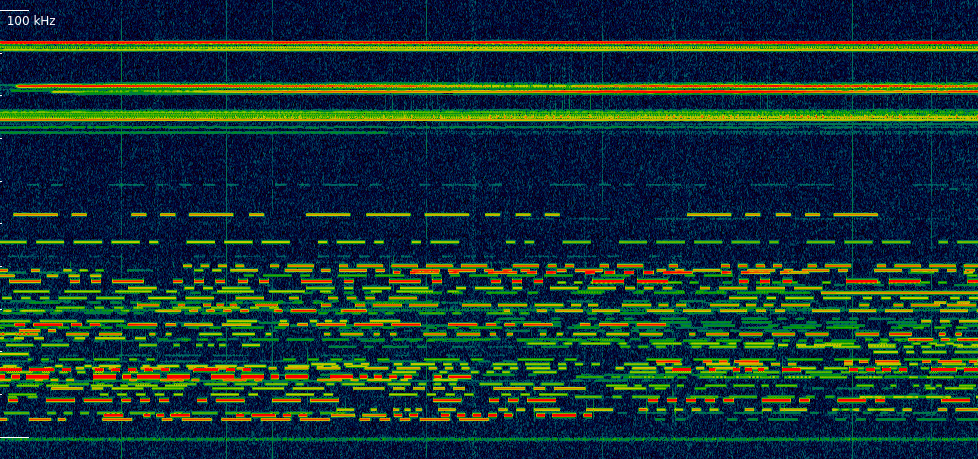

# Getting I/Q SDR data from Icom IC-7610's USB 3 port using libftd3xx

I had been looking around for some time if someone had already managed to get
I/Q data from Icom's IC-7610 HF transceiver without going through the
binary-only hdsdr driver provided by Icom, but couldn't find anything.

First attempts at doing that on Debian Linux using libftdi1 didn't work, so I
resorted to using the (again binary-only) libftd3xx driver from FT, and
succeeded after some tinkering around.

The program here writes raw I/Q data to a file in int16-int16 format.

* Get libftd3xx from https://ftdichip.com/drivers/d3xx-drivers/
* IC-7610 I/Q port reference: https://www.icomjapan.com/support/manual/1792/
* The IC-7610 needs to be connected using a decent USB 3 cable, preferably without any hub in-between
* If the SuperSpeed-FIFO Bridge disappears after some time, re-plug the cable or power-cycle the transceiver

## Usage

* Write to file: `./ic7610ftdi filename.cs16`
* Send to TCP socket: `./ic7610ftdi host port

```
$ lsusb | grep IC
Bus 002 Device 024: ID 0c26:0029 Prolific Technology Inc. IC-7610 SuperSpeed-FIFO Bridge

$ make
cc -Wall -g   -c -o ic7610ftdi.o ic7610ftdi.c
cc   ic7610ftdi.o  -lftd3xx -o ic7610ftdi

$ ./ic7610ftdi iq.cs16
Device[0]
	Flags: 0x4 [USB 3] | Type: 600 | ID: 0x0C260029
	SerialNumber=23001123
	Description=IC-7610 SuperSpeed-FIFO Bridge
fe fe 98 e0 1a 0b fd ff 
fe fe e0 98 1a 0b 00 fd IQ data output: 0
fe fe 98 e0 1a 0b 01 fd 
fe fe e0 98 fb fd ff ff OK
RX 42 MiB ^C
fe fe 98 e0 1a 0b 00 fd 
fe fe e0 98 fb fd ff ff OK

$ ls -l iq.cs16
-rw-rw-r-- 1 myon myon 44040192 26. Aug 22:37 iq.cs16

$ inspectrum -r 1920000 iq.cs16 &
```



## GNU Radio Flowgraph

The `ic7610iq.pdf` flowgraph can receive data sent by `ic7610ftdi localhost 2000`.


## Author

Copyright (C) 2023 Christoph Berg DF7CB <cb@df7cb.de>

Permission is hereby granted, free of charge, to any person obtaining a copy
of this software and associated documentation files (the "Software"), to deal
in the Software without restriction, including without limitation the rights
to use, copy, modify, merge, publish, distribute, sublicense, and/or sell
copies of the Software, and to permit persons to whom the Software is
furnished to do so, subject to the following conditions:

The above copyright notice and this permission notice shall be included in all
copies or substantial portions of the Software.

THE SOFTWARE IS PROVIDED "AS IS", WITHOUT WARRANTY OF ANY KIND, EXPRESS OR
IMPLIED, INCLUDING BUT NOT LIMITED TO THE WARRANTIES OF MERCHANTABILITY,
FITNESS FOR A PARTICULAR PURPOSE AND NONINFRINGEMENT. IN NO EVENT SHALL THE
AUTHORS OR COPYRIGHT HOLDERS BE LIABLE FOR ANY CLAIM, DAMAGES OR OTHER
LIABILITY, WHETHER IN AN ACTION OF CONTRACT, TORT OR OTHERWISE, ARISING FROM,
OUT OF OR IN CONNECTION WITH THE SOFTWARE OR THE USE OR OTHER DEALINGS IN THE
SOFTWARE.
